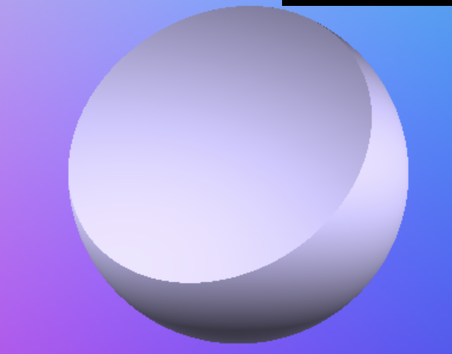
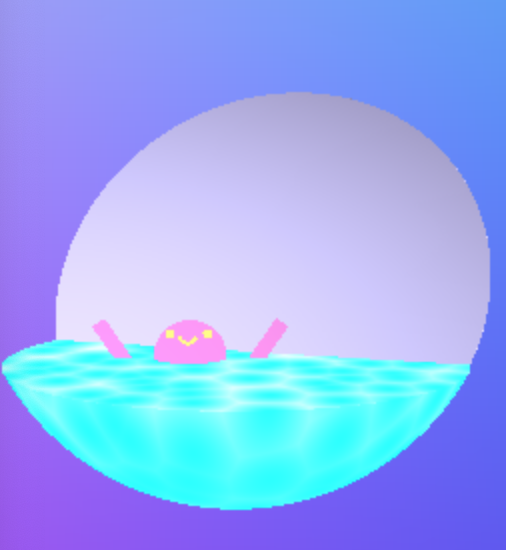
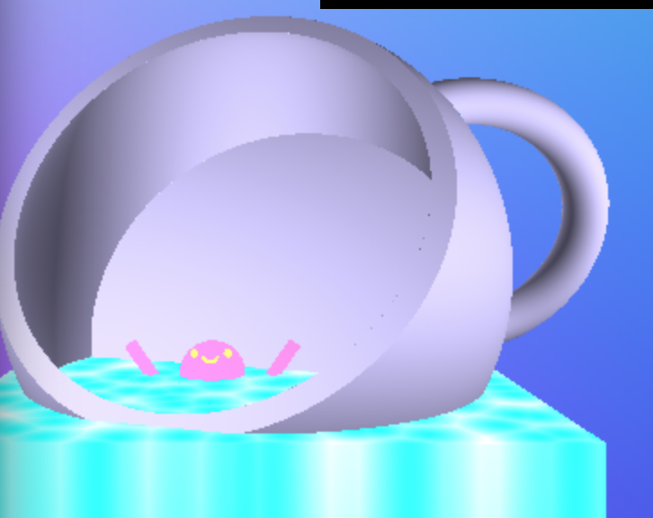
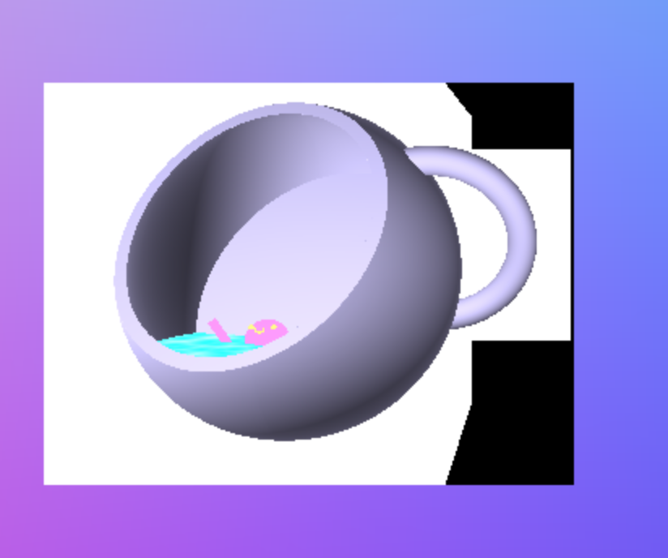

Amy Chen // amyjchen

Link:
https://merunicorn.github.io/hw02-raymarching-sdfs/

External Resources:
- rayMarch function written with supplied reference: http://jamie-wong.com/2016/07/15/ray-marching-signed-distance-functions/
- SDF functions written with ray-marching slides/IQ code
- SDF transformation fxns written with IQ reference code http://www.iquilezles.org/www/articles/distfunctions/distfunctions.htm
- Worley Noise referenced from Adam’s Kiluaea Lava shadertoy code
- Slide 21 of this presentation used to determine bounding box min/max of sphere: https://pubweb.eng.utah.edu/~cs6965/slides/06.pdf

Detailed Explanation:
- Ray Cast
    - Reused own 461 raycasting code
- SDF
    - Played around with different SDFs to render three major scene attributes (cup, liquid in cup, character)
    - I generally had trouble getting the subtraction operation to act as expected, so I used the intersection operation a lot instead to achieve desired effect (but I still had trouble cutting off the liquid at the flat bottom of the cup, so that’s still visible if you rotate the cup)
    - Steps:
        - Cup
            - Sphere intersecting with Box to get the hemisphere cup shape
            
            - Torus to get the handle shape
            - Subtract sphere to hollow out the cup
            - Add in a slice of a Sphere intersecting with Box to get a flat bottom for the cup
            
        - Liquid
            - Sphere (same size as the one subtracted from cup) intersecting with Box
            
        - Character
            - Sphere union’ed with smaller Spheres for head
            - Cylinders for arms
            - small Torus intersecting with small Sphere for smile
- Different Colored Materials
    - Edited Ray March function from supplied resource to output an object ID, as well as test against multiple SDF functions (so I could color each distinct group of objects differently)
    - Ensured that Ray March function would increment t by the smallest distance of all tests (weird artifacts otherwise)
    - Called function to calculate surface normal of specific SDF groups for blinn-phong shading
- Noise
    - Added worley noise to give the liquid a water/ripple-y effect
    - Edited resulting color to have less of a range/gradient so that the effect is more like flat shading/toon shading
- Bounding Boxes
    - Used Ray-Cube intersection code from slides
    - Determined the min/max of object bounding boxes based on the major geometry
        - For bounding box of cup (not including handle), I simply took the attributes of the largest sphere to calculate it
        - For bounding box of handle, I similarly used the radius to calculate it
        - Grouped both these major bounding boxes into a root bounding box
        - All my other geometry was already encompassed within the “cup” bounding box, so my hierarchy was pretty simple
        
- Toolbox functions
    - Used code from the slides to:
        - add an ease in/out movement to the cup position bobbing animation
        - add a linear ease to the waving of the character’s arms
- Dat.GUI
    - Passing in a vec4 as u_Color to directly adjust the color of the character in scene
    - A checkbox/boolean as u_Anim to toggle whether or not the character’s arms are animated

